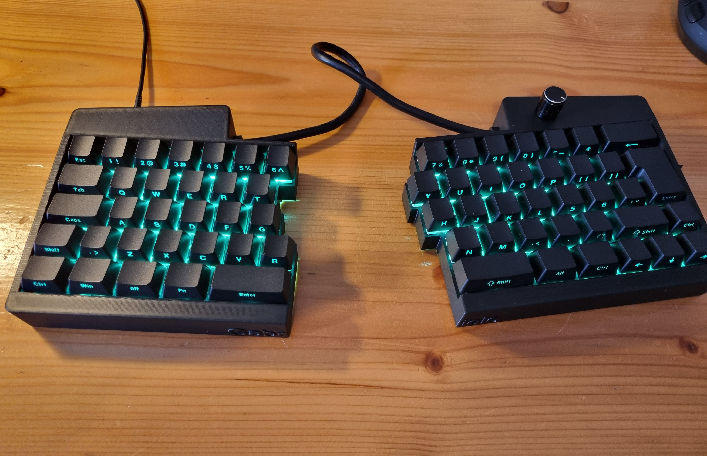
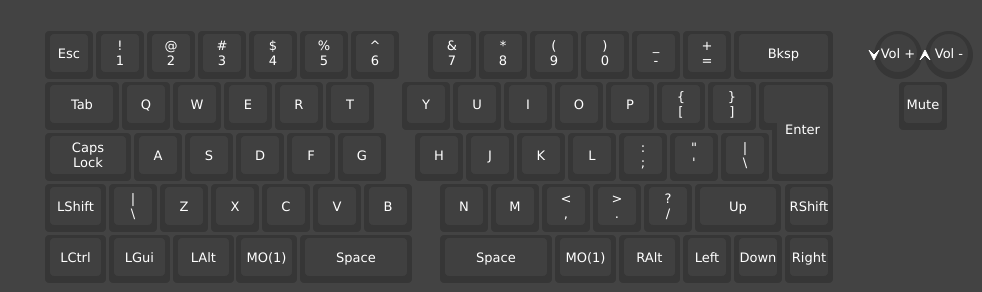
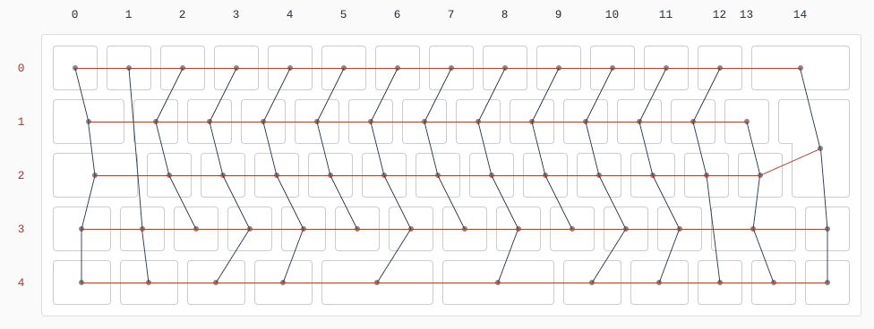
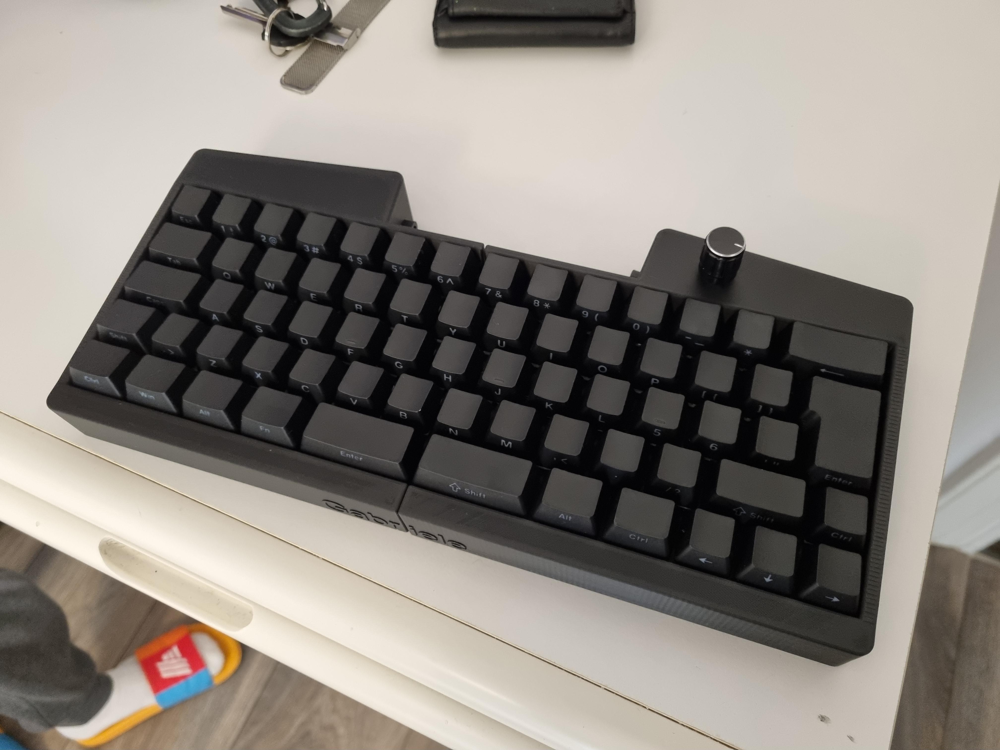

# Firmware for my personal split keyboard (inspired from UHK)
This it a modified vial-qmk firmware for my personal split keyboard. I created a keyboard by drawing it in 3d with fusion 360 and then printing it with my 3d printer. I soldered the various components (switches, diodes, encoders...) and connected everything to a Raspberry pi pico (type c version).
I used an HDMI cable as the connection between the two parts (because it has 19 wires available). I know, it's not the best, but it's my first electronics job and I also wanted to save money!

## Features
- keyboard format: iso 60% modified to have arrows keys! (I'm not ready to give it up!)
- button encoder: for volume control and screen brightness
- type c port (type c / usb A cable is required to connect to pc)
- VIAL software: i really liked VIAL because you only need a web browser to connect to the keyboard software and edit keys, create macros, combos and more)

## Steps
1) Move this git repository to keyboards repository of vial-qmk and rename it to "split_keyboard_gabriele"
2) use the command (qmk compile -kb "name of the keyboard folder" -km "name of the keyboard layout that is vial if you want to use with vial): 
    `qmk compile -kb split_keyboard_gabriele -km vial` or directly `qmk flash -kb split_keyboard_gabriele -km vial` (you need a Rasberry Pi Pico linked and in flash mode)

<!-- *A short description of the keyboard/project*

* Keyboard Maintainer: [Gabriele](https://github.com/Gabriele-tomai00)
* Hardware Supported: *The PCBs, controllers supported*
* Hardware Availability: *Links to where you can find this hardware*

Make example for this keyboard (after setting up your build environment):

    make gabriele:default

Flashing example for this keyboard:

    make gabriele:default:flash

See the [build environment setup](https://docs.qmk.fm/#/getting_started_build_tools) and the [make instructions](https://docs.qmk.fm/#/getting_started_make_guide) for more information. Brand new to QMK? Start with our [Complete Newbs Guide](https://docs.qmk.fm/#/newbs).

## Bootloader

Enter the bootloader in 3 ways:

* **Bootmagic reset**: Hold down the key at (0,0) in the matrix (usually the top left key or Escape) and plug in the keyboard
* **Physical reset button**: Briefly press the button on the back of the PCB - some may have pads you must short instead
* **Keycode in layout**: Press the key mapped to `QK_BOOT` if it is available -->
